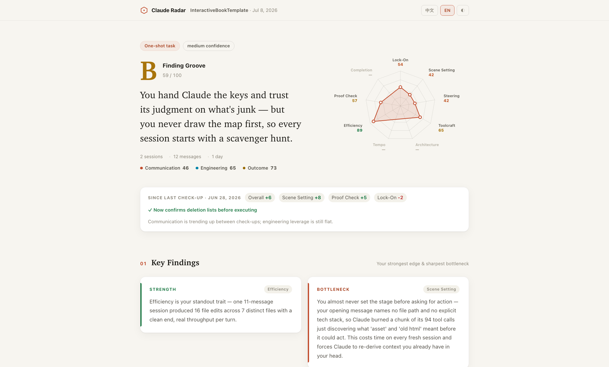

# Claude Radar （Optimized with Fable 5）

> **A Claude Code plugin that reads your project conversation records and grades how well you collaborate with AI.** 9 dimensions across 3 categories — Communication, Engineering, Outcome. Returns a free-form AI diagnosis, at-least-5 pastable improvement prompts, and a professional, readable HTML dashboard. 100% local.

🌏 [中文版](./README_zh.md) · 📖 [Methodology](./docs/METHODOLOGY.md) · 🖥 [Live preview](https://leifdiao.github.io/claude-radar/) · ⚖️ [License](./LICENSE)

> **中文简介：** 一款 Claude Code 插件，读取你的项目对话记录，从「沟通力 / 工程力 / 成效」三个层面、9 个维度评估你和 AI 的协作质量。输出一份 AI 撰写的协作诊断、至少 5 条可直接粘贴的改写 prompt，以及一个专业可读的 HTML dashboard。所有计算 100% 本地完成。完整中文文档 → [README_zh.md](./README_zh.md)



---

## Key features

**🎯 Reads your actual sessions, not synthetic prompts.** Most "AI productivity" tools test you on contrived examples. Claude Radar analyzes the real conversations you've had with Claude — every directing, correcting, and confirming message, plus every tool call you made.

**💬 AI writes you a coaching note, not just a scoreboard.** Beyond the 9 scores, you get a 150-word collaboration profile that describes how *you specifically* work with AI, a one-paragraph core diagnosis pairing your strongest strength with your most critical bottleneck, and a cross-dimension reading that explains how your behaviors combine. Every claim cites evidence from your real session.

**📋 Every suggestion is a pastable prompt.** No "be more thoughtful" advice. Each of the 5–7 improvement suggestions comes with a concrete prompt you can copy-paste straight into your next session, plus the expected score impact and the trade-off.

**⚖️ Project-aware fairness.** A 3-message bugfix isn't compared to a 50-session feature build. Claude Radar auto-classifies each project (`one-shot` / `feature-build` / `long-running` / `learning`) and applies different category weights and N/A rules. Density-based confidence prevents short-but-substantive sessions from being unfairly shrunk.

**🛠 Scores how you use the platform, not just how you talk.** The Engineering category measures Skills, MCP servers, Subagents, **Workflow orchestration, parallel fan-out, background tasks**, CLAUDE.md, `.mcp.json`, hooks, Plan mode, and custom commands — the leverage most users underuse. Not using advanced tools is fine; using them poorly (retry loops, plan-then-abandon) is what hurts.

**📦 Suggestions ship as installable assets.** Beyond pastable prompts, `setup`-type suggestions include the actual file content — a CLAUDE.md section, a hook config, an `.mcp.json` entry, a custom command — drawn from an open, trigger-matched playbook (`data/playbook.json`) and personalized with your session evidence.

**📈 Tracks your progress.** Reports are archived locally; each new run shows score deltas since your last check-up and detects which past suggestions you actually adopted (CLAUDE.md created, hooks configured, plan mode in use…).

**🔒 100% local, zero telemetry.** Read-only access to your local Claude Code project records. No API key, no cloud, no network calls. Bilingual (English + 中文) reports built in.

> **中文要点：**
> - **🎯 评估你真实的项目对话记录**，不靠人工题库
> - **💬 AI 给你写诊断信**：协作画像 + 强项/瓶颈段 + 维度交叉解读，每条结论都引用真实证据
> - **📋 每条建议都附可粘贴 prompt**，不讲空话；附预期分数影响和取舍说明
> - **⚖️ 按项目类型公平评分**：bugfix 不和大项目用同一把尺子，密度高的短会话不会被打压
> - **🛠 专门评估平台杠杆**：Skill / MCP / Subagent / CLAUDE.md / Plan 模式 —— 不用不扣分，用得差才扣分
> - **🔒 100% 本地，零数据上传**，原生中英双语，输出专业可读的 HTML dashboard
>
> 完整中文版 → [README_zh.md](./README_zh.md)

---

## What's new in v1.2

The report page was redesigned from the ground up with **Claude (Fable 5)** — from a metrics dashboard into an editorial check-up report:

- **New report UI** — warm editorial layout, a 9-dimension radar chart front and center, light/dark themes, refined typography.
- **The important stuff surfaced first** — report schema 2.2 adds structured `highlights` (your strength & bottleneck as first-class data) and `isKeyAction` flags, so Key Findings and the top 1-2 actions lead the page instead of hiding among equal-weight cards.
- **Fully backward compatible** — archived 2.1 reports render fine in the new template.

The scoring pipeline (deterministic baselines, playbook triggers, longitudinal tracking) is unchanged.

---

## What the report includes

Run `/claude-radar` and get a single-file HTML report, designed to read like a check-up from a coach — most important things first:

**The verdict** — your S–D grade, a one-sentence coach's wake-up call, and a 9-dimension radar chart, side by side. Your project profile is always shown so you know what scale you're being judged on. If you've run a check-up before, score deltas and adopted suggestions appear right below.

**Key Findings** — your strongest edge and sharpest bottleneck as two highlighted cards, each anchored to the dimension it comes from, plus a cross-dimension reading of how your behaviors combine. This is the part most users find valuable.

**Do These Next** — the 1-2 highest-leverage suggestions as large numbered cards with the pastable prompt front and center; the remaining 3-5 fold into an accordion. Every suggestion carries cited evidence, a copy-paste prompt rewrite, and the expected score impact — `setup` moves also ship the installable file content. High-scoring users get "level-up moves" instead of corrective ones.

**Nine Dimensions** — compact score rows grouped by category (Communication / Engineering / Outcome); click any row to expand the full scoring rationale and evidence.

**Collaboration Profile & appendix** — a free-form narrative of how you specifically work with AI, plus a collapsed appendix with tool usage, orchestration stats, and project-asset detection (CLAUDE.md, hooks, skills…).

Light & dark themes, English/中文 toggle, print-friendly.

---

## Install

**Step 1** — Add the marketplace:

```
/plugin marketplace add LeifDiao/claude-radar
```

**Step 2** — Install the plugin:

```
/plugin install claude-radar@claude-radar-marketplace
```

**Alternative (local):**

```bash
git clone https://github.com/LeifDiao/claude-radar.git ~/claude-radar
claude --plugin-dir ~/claude-radar
```

---

## Use

```
/claude-radar
```

1. Claude Radar detects your current working directory and asks "analyze this project?"
2. Say yes, or pick from the recent-10 list
3. Wait for parsing + diagnosis to finish (time varies with project size)
4. The dashboard opens in your browser

---

## Requirements

- **Claude Code** with plugin support
- **Node.js 18+** (already ships with Claude Code)
- No `npm install`, no build step, no server

---

## Privacy

Your session data stays on your machine:

- Everything runs locally — no network calls
- No API key, no telemetry, no cloud
- `~/.claude/projects/` is read-only
- Reports write to `~/.claude-radar/reports/`
- CLAUDE.md / memory / agents detection only reads filesystem metadata, never file contents (except CLAUDE.md size)

---

## How scoring works

**Two-layer model:**

1. **Scoring** — baselines are computed **entirely in script** (`compute-baselines.mjs` evaluates the structured formulas in `rubric.json`) — zero run-to-run variance — plus a bounded Claude ±15 adjustment that must cite evidence or stay at zero.
2. **Diagnosis** — independent qualitative pass. Free-form 150-word collaboration profile, core diagnosis, cross-dimension reading, grounded in dimension-targeted evidence moments extracted by the parser.

**Fairness mechanisms:**

- **Project profile** drives category weighting and N/A dimensions
- **Density-based confidence** — a 5-message project with high signal density no longer gets unfairly shrunk
- **Efficiency as a first-class signal** — "3 messages, 5 files edited" is recognized as high efficiency, not penalized as low volume

👉 [Read the full Methodology](./docs/METHODOLOGY.md)

---

## Transparent rubric

All scoring rules live in [`data/rubric.json`](./data/rubric.json):

- 9 dimension definitions, baseline formulas, applicability rules
- 3 category groupings with per-profile weight tables
- Grade thresholds (S/A/B/C/D)
- Diagnosis and suggestion specifications
- Density-based confidence scaling

If you want scoring to match your team's standards, edit this file — the scoring engine re-reads it every run. Suggestions live in [`data/playbook.json`](./data/playbook.json) the same way: each move is a trigger condition + bilingual copy + optional installable asset template. Run `node test/run.mjs` after editing.

---

## Project structure

```
claude-radar/
├── .claude-plugin/plugin.json        # plugin manifest
├── skills/analyze/
│   ├── SKILL.md                      # flow: detect → parse → baselines → adjust/diagnose → render
│   └── scripts/
│       ├── list-projects.mjs         # scan projects + cwd match
│       ├── parse-project.mjs         # facts extraction (injection filtering, orchestration signals,
│       │                             #   slash commands, assets, dimension evidence)
│       ├── compute-baselines.mjs     # deterministic scoring + playbook triggers + last-run compare
│       └── render-report.mjs         # JSON → HTML + history archive
├── viewer/template.html              # dashboard report template
├── data/
│   ├── rubric.json                   # 9-dim structured formulas + profile weights + diagnosis spec
│   └── playbook.json                 # 30+ trigger-matched suggestion moves with asset templates
├── test/run.mjs                      # regression suite (fixtures + baseline arithmetic + triggers)
└── docs/
    ├── METHODOLOGY.md                # methodology (English)
    └── METHODOLOGY_zh.md             # methodology (Chinese)
```

About 300 KB. Zero runtime dependencies. Run `node test/run.mjs` to verify the deterministic layer.

---

## License

Claude Radar is released under **CC BY-NC 4.0**:

- ✅ **Free** for personal, educational, research, and any non-commercial use
- ✅ **Forking, modifying, sharing** is welcomed — please attribute the original repo and indicate any changes you made
- ❌ **Commercial use** (bundling into paid products, internal use beyond individual scope in for-profit companies, paid SaaS hosting, selling reports/analyses based on the scoring) requires a separate license

**For commercial licensing**, contact: **leifdiao@gmail.com**

See [LICENSE](./LICENSE) for the full terms, including the 中文版说明.

---

*Built for people who care about the quality of AI collaboration.*
