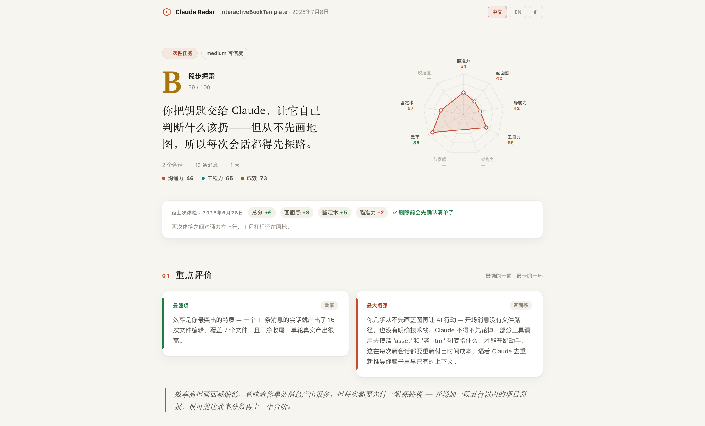

# Claude Radar

> **一款 Claude Code 插件，读取你的项目对话记录，评估你和 AI 协作的质量。** 从「沟通力 / 工程力 / 成效」三个层面、9 个维度打分，输出 AI 自由撰写的诊断、至少 5 条可直接粘贴的 prompt 改写，以及一个专业可读的 HTML dashboard。全程本地。

🌏 [English](./README.md) · 📖 [方法论](./docs/METHODOLOGY_zh.md) · 🖥 [在线预览](https://leifdiao.github.io/claude-radar/) · ⚖️ [协议](./LICENSE)

> **English summary:** A Claude Code plugin that reads your project conversation records and grades how you collaborate with AI across 9 dimensions in 3 categories. Returns an AI-written diagnosis, at-least-5 pastable improvement prompts, and a professional, readable HTML dashboard. 100% local. Full English docs → [README.md](./README.md)

---

## 核心特性

**🎯 评估你真实的项目对话记录，不靠人工题库。** 大多数"AI 协作分析"工具用合成提示考你，Claude Radar 分析你这个月真的和 Claude 聊过的内容 —— 每条 directing / correcting / confirming 消息、每次工具调用都被纳入评估。

**💬 AI 给你写诊断信，而不是只给分数。** 9 个分数之外，你会拿到一份 150 字的协作画像（描述你具体的协作方式）、一段"强项 + 瓶颈"核心诊断、维度交叉解读，每条结论都引用真实证据。

**📋 每条建议都带可粘贴 prompt。** 不讲"要多思考"这种空话。5–7 条改进建议每条都附一段下次会话可以直接复制粘贴的具体话术，外加预期分数影响和取舍说明。

**⚖️ 按项目类型公平评分。** 3 条消息修完的 bug 不会和 50 个 session 的功能开发用同一把尺子。Claude Radar 自动归类（一次性 / 功能开发 / 长期 / 学习），按类别套用不同的权重和 N/A 规则。密度驱动的 confidence 让短但信号密集的会话不会被无理由打折。

**🛠 专门评估你怎么用平台，不只是怎么说话。** 工程力类目衡量你对 Skill、MCP、Subagent、**Workflow 编排、并行分发、后台任务**、CLAUDE.md、`.mcp.json`、hooks、Plan 模式、自定义命令的使用 —— 大多数用户都没用足的杠杆。**不用高级工具不扣分，用了但用不好（retry loop、Plan 进了又抛）才扣分。**

**📦 建议不止是话术，还是可安装的资产。** `setup` 类建议直接附上文件内容 —— CLAUDE.md 章节、hook 配置、`.mcp.json` 条目、自定义命令 —— 出自一个开源的、按触发条件匹配的招式库（`data/playbook.json`），再用你的真实会话证据个性化。

**📈 记录你的进步。** 报告本地归档；每次重跑都会显示距上次体检的分数变化，并自动检测哪些历史建议真的被采纳了（CLAUDE.md 建了没、hooks 配了没、Plan 模式用起来没）。

**🔒 全本地，零数据上传。** 只读访问本地项目对话记录，不发任何网络请求、无 API key、无云端。原生中英双语报告。输出一个专业可读的 HTML dashboard。

> **English highlights:**
> - **🎯 Reads your real project conversation records**, not synthetic prompts
> - **💬 AI writes a coaching note** with evidence — not just scores
> - **📋 Every suggestion is a pastable prompt** + expected impact
> - **⚖️ Project-aware fairness** — a bugfix isn't compared to a big feature
> - **🛠 Evaluates platform leverage** (Skill / MCP / Subagent / CLAUDE.md / Plan mode)
> - **🔒 100% local, zero telemetry**, bilingual, professional, readable HTML dashboard
>
> Full English version → [README.md](./README.md)

---

## v1.2 更新了什么

报告页面由 **Claude (Fable 5)** 从头重塑 —— 从指标仪表盘变成一份「体检报告」：

- **全新报告 UI** —— 暖色编辑排版、首屏 9 维雷达图、明暗双主题、更讲究的字体层次。
- **重点内容前置** —— report schema 升级到 2.2，新增结构化的 `highlights`（最强项/最大瓶颈成为一等数据）和 `isKeyAction` 标记，重点评价和前 1-2 条重点建议直接领衔整页，不再淹没在等权重的卡片里。
- **完全向后兼容** —— 已归档的 2.1 报告在新模板下照常渲染。

评分管线（确定性基线、playbook 触发、纵向追踪）保持不变。

---

## 报告里有什么

运行 `/claude-radar`，你会得到一个单文件 HTML 报告，按「教练体检报告」的思路排布 —— 最重要的内容永远在最前面：



**总评判定** —— S–D 等级、一句话点醒你的核心洞察、9 维雷达图并排呈现。项目画像类型永远标注在旁，让你知道自己是用什么尺子被量。做过体检的项目还会在下方直接显示分数变化和已落地的建议。

**重点评价** —— 最强项和最大瓶颈做成两张高亮卡，各自锚定到对应维度，配一段维度交叉解读。**这是用户最看重的部分。**

**重点建议** —— 杠杆最大的 1-2 条建议放大成编号大卡，可粘贴 prompt 前置；其余 3-5 条折叠成手风琴。每条都带真实证据、可复制的 prompt 改写、预期分数影响 —— `setup` 类建议还附带可直接安装的文件内容。高分用户拿到的是 "level-up" 进阶动作而非纠错。

**九维得分** —— 按「沟通力 / 工程力 / 成效」分组的紧凑得分行，点开任意一行看完整评分依据和证据。

**协作画像与附录** —— 一段专属于你的协作方式白描，外加默认折叠的附录：工具使用、编排统计、项目资产检测（CLAUDE.md、hooks、skills…）。

明暗双主题、中英切换、打印友好。

---

## 安装

**第一步** —— 添加插件市场：

```
/plugin marketplace add LeifDiao/claude-radar
```

**第二步** —— 安装插件：

```
/plugin install claude-radar@claude-radar-marketplace
```

**本地安装：**

```bash
git clone https://github.com/LeifDiao/claude-radar.git ~/claude-radar
claude --plugin-dir ~/claude-radar
```

---

## 使用

```
/claude-radar
```

1. Claude Radar 检测你的当前工作目录，问"是不是分析这个项目"
2. 确认即用，或者从「最近 10 个项目」列表中选
3. 等待解析 + 诊断完成（时长视项目大小而定）
4. Dashboard 自动在浏览器打开

---

## 环境要求

- **Claude Code** —— 支持插件版本
- **Node.js 18+** —— Claude Code 自带
- 不用 `npm install`、不用编译、不用服务

---

## 隐私

你的会话数据始终留在本地：

- 所有计算本地完成 —— 不发任何网络请求
- 无 API key、无遥测、无云端
- `~/.claude/projects/` 只读访问
- 报告写入 `~/.claude-radar/reports/`
- CLAUDE.md / memory / agents 检测只读文件系统元数据，不读取文件内容（CLAUDE.md 只读取大小）

---

## 评分原理

**两层模型：**

1. **评分层** —— 基线**全部由脚本计算**（`compute-baselines.mjs` 执行 `rubric.json` 里的结构化公式），零运行方差；Claude 只做 ±15 微调,且必须引用证据,否则保持 0。
2. **诊断层** —— 独立的定性分析。150 字协作画像 + 核心诊断 + 交叉解读，全部锚定在解析器专门抽取的"维度证据瞬间"上。

**公允性机制：**

- **项目画像**驱动分类权重和 N/A 维度
- **密度驱动的 confidence** —— 5 条消息但信号密度高的项目不会被无理由打折
- **效率作为一等公民信号** —— "3 条消息 5 个文件编辑" 被识别为高效，不再被当作"消息少"扣分

👉 [完整方法论](./docs/METHODOLOGY_zh.md)

---

## 评分规则全公开

所有评分规则都在 [`data/rubric.json`](./data/rubric.json)：

- 9 个维度的定义、基线公式、适用性规则
- 3 大类聚合 + 按 profile 的权重表
- 等级阈值（S/A/B/C/D）
- 诊断层和建议层的产出规范
- 密度驱动的 confidence 缩放

想让评分更贴合团队习惯？改这个文件就行，评分引擎每次运行都重新读。建议招式同理，都在 [`data/playbook.json`](./data/playbook.json)：每条招式 = 触发条件 + 双语文案 + 可选的可安装资产模板。改完记得跑 `node test/run.mjs`。

---

## 项目结构

```
claude-radar/
├── .claude-plugin/plugin.json        # 插件清单
├── skills/analyze/
│   ├── SKILL.md                      # 流程：检测 → 解析 → 基线 → 微调/诊断 → 渲染
│   └── scripts/
│       ├── list-projects.mjs         # 扫项目 + cwd 匹配
│       ├── parse-project.mjs         # 信号提取（注入过滤、编排信号、斜杠命令、资产、维度证据）
│       ├── compute-baselines.mjs     # 确定性评分 + 招式触发匹配 + 上次报告对比
│       └── render-report.mjs         # JSON → HTML + 历史归档
├── viewer/template.html              # Dashboard 报告模板
├── data/
│   ├── rubric.json                   # 9 维结构化公式 + 画像权重 + 诊断规范
│   └── playbook.json                 # 30+ 条按条件触发的建议招式（含资产模板）
├── test/run.mjs                      # 回归测试（fixtures + 基线算术 + 触发器）
└── docs/
    ├── METHODOLOGY.md                # 方法论（英文）
    └── METHODOLOGY_zh.md             # 方法论（中文）
```

约 300 KB，零运行时依赖。跑 `node test/run.mjs` 可验证确定性层。

---

## 协议

Claude Radar 采用 **CC BY-NC 4.0** 协议授权：

- ✅ **免费** 用于个人、教育、研究等任何非商业场景
- ✅ **允许** fork、修改、分享 —— 请注明原作者和原仓库出处，并标注是否做了修改
- ❌ **商业用途**（打包进付费产品、营利组织超出员工个人评估范围、付费 SaaS 托管、基于评分卖报告/分析等）需要单独的商业授权

**商业授权咨询：** **leifdiao@gmail.com**

完整协议条款（含英文版）请见 [LICENSE](./LICENSE)。

---

*为关心 AI 协作质量的人而做。*
